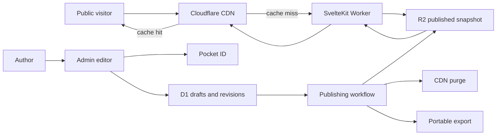

# Publishing Platform Technical Plan

## 1. Purpose

This document defines the architecture and implementation plan for evolving aamirazad.com from a small static Astro homepage into a durable, self-hosted publishing experience. The finished site will continue to feel like a simple personal website while adding an authenticated, on-site CMS for articles, notes, projects, links, quotes, and photos.

The primary goals are:

- Make publishing from a desktop or phone fast and convenient.
- Preserve published content for as long as desired in open, exportable formats.
- Keep public pages extremely fast and usable without client-side JavaScript.
- Keep the public site available when the database, identity provider, or publishing pipeline is temporarily unavailable.
- Preserve all existing homepage information, public URLs, and redirects.
- Avoid tying content to a proprietary editor representation or a single recovery mechanism.

This is a technical plan. It does not define the final visual design in detail, although it establishes the rendering, performance, accessibility, and content requirements the design must satisfy.

## Implementation Status and Agent Handoff

Last updated: 2026-07-18.

Implementation is continuing on branch `codex/publish-content`. Phases 0 through 6 are complete and tested at their stopping points:

| Phase                                 | Status   | Commit          |
| ------------------------------------- | -------- | --------------- |
| 0 — Decisions and baseline            | Complete | `1684dc0`       |
| 1 — SvelteKit foundation              | Complete | `e8866bf`       |
| 2 — Storage and authentication        | Complete | `c336a13`       |
| 3 — Draft editor                      | Complete | `1a5a296`       |
| 4 — Publishing projection             | Complete | `45b02b9`       |
| 5 — Caching and performance hardening | Complete | `12c0622`       |
| 6 — Portable export and recovery      | Complete | Pending handoff |
| 7 — Publishing experience refinement  | Pending  | Not started     |
| 8 — Production cutover                | Pending  | Not started     |
| 9 — Convenience improvements          | Deferred | Not started     |

The Phase 4 Worker is deployed at `https://preview.aamirazad.com` as version `17d3a79c-4382-44a8-af66-e21ac74877bb`. Production has not been cut over. Preview D1 has no pending migrations. The final verification completed with 11 application tests, 7 Worker integration tests, zero Svelte diagnostics, a successful production build, and a successful deployed publish/archive lifecycle. The runtime test confirmed that a cached post, feed, and sitemap were projected from R2 and that archiving caused the very next article request to miss cache and return `404`. The temporary verification post was archived and soft-deleted; its immutable preview job and audit history intentionally remain.

The Phase 5 Worker is deployed to preview as version `b7e78d11-abfd-43f3-96f0-f2bcb47942aa`. Public HTML was observed moving from `MISS` to `HIT`, the same public response remained cacheable when a session cookie was supplied, and `/admin` remained `private, no-store` with Cloudflare cache bypass. The stopping-point checks pass with 13 application tests, 7 Worker integration tests, zero Svelte diagnostics, a successful production build, 2,525 compressed CSS bytes, and no required public JavaScript. Live Lighthouse and multi-region measurements are intentionally deferred until the main publishing functionality is complete.

The Phase 6 Worker is deployed to preview as version `09cc7779-2d85-489c-afa2-b8b993fe858e`. The portable TAR contains Markdown working copies and revisions, versioned metadata, aliases, asset relationships, original media, generated variants, and the current public projection while excluding authentication and operational records. The recovery integration test deletes every exported content and media object and restores the readable public post using only fresh `CONTENT` and `MEDIA` bindings, without D1. Preview migration `0003_remove_backup_scaffolding.sql` is applied, preview has no pending migrations, and the unused `BACKUPS` bindings and `backup_jobs` table are gone. The stopping point passes 15 application tests, 8 Worker integration tests, zero Svelte diagnostics, formatting, and the production build.

Phase 5 added the following safeguards:

1. Audit the existing Workers Cache configuration, public response headers, cache tags, Static Assets routing, and private-route bypass behavior. Preserve the public-entrypoint purge RPC in `worker.ts`; Workers Cache purges are entrypoint-scoped.
2. Add responsive image variants while retaining immutable R2 originals, then verify variant dimensions, formats, cache policy, and fallbacks.
3. Add automated public asset-size and Lighthouse CI budgets.
4. Test anonymous pages and authenticated routes for session leakage or accidental caching.
5. Verify deployed preview cache hits, public responses with a session cookie, administrative cache bypass, and static asset headers.
6. Keep Lighthouse and multi-region measurements configured but defer running them until after the main publishing functionality is complete, as directed by the owner on 2026-07-18.

Important handoff details:

- Public rendering reads published snapshots from `CONTENT` R2 and must remain independent of D1 and Pocket ID.
- `worker.ts` owns canonical HTTPS request normalization, public cache headers, cache tags, and default-entrypoint purging. Do not replace it with the adapter-generated Worker; `wrangler.svelte.jsonc` keeps those entrypoints separate.
- Preview authentication is configured and has been confirmed by the owner. Do not assume the local `.env` contains the deployed `SESSION_SECRET`; never print or attempt to retrieve deployed secret values.
- Phase 6 removed the obsolete `BACKUPS` bindings and `backup_jobs` table. Do not reintroduce a scheduled D1, R2, or off-provider backup system; the approved recovery mechanism is the owner-triggered portable export documented in `build-docs/operations.md`.
- The `old-site` directory remains reference-only for content and visual style. Continue building the SvelteKit application with the new stack.

## 2. Original Baseline State

At the time this plan was written, the repository contained a minimal static Astro site:

- One homepage at `src/pages/index.astro`.
- Contact, project, and homelab data in `src/data/links.ts`.
- A shared layout and a single global stylesheet.
- A set of important redirects in `astro.config.mjs`.
- No checked-in production server adapter, database, authentication system, or CMS.

The refactor should be treated as a new application with a parity migration, not as an incremental extension of an existing backend. The current site must remain deployable until the replacement has passed parity and recovery testing.

## 3. Architectural Decisions

### 3.1 Application framework

Use SvelteKit with TypeScript and `@sveltejs/adapter-cloudflare`, deployed as a Cloudflare Worker with Workers Static Assets. Use `pnpm` exclusively for dependency management and project scripts. The committed `packageManager` field and `pnpm-lock.yaml` are authoritative; documentation, CI, and operational commands must use `pnpm` rather than `npm`, Yarn, or Bun.

Cloudflare CLI commands should be run through the project-local Wrangler dependency using `pnpm exec wrangler ...`. This keeps local development and CI on the same Wrangler version instead of depending on an untracked global installation.

SvelteKit is being selected for the unified full-stack experience rather than because it inherently sends less JavaScript than Astro. Public performance will come from server-rendering or prerendering HTML, disabling unnecessary client-side hydration, serving immutable static assets, and caching public responses at Cloudflare. The authenticated editor can remain a richer client-side application.

Public and administrative routes must have deliberately different rendering behavior:

- Public content routes: server-rendered HTML, with `csr = false` wherever client-side navigation or interactive components are not required.
- Small public enhancements: progressively enhanced and isolated; they must not be prerequisites for reading content.
- Administrative routes: server-rendered initially, then hydrated for autosave, previews, uploads, and other editor interactions.
- Static files: emitted as fingerprinted build assets and served directly by Workers Static Assets.

### 3.2 Hosting and runtime

Use Cloudflare Workers as the production runtime. The application, static assets, D1 bindings, R2 bindings, scheduled jobs, and Workflows configuration should be declared in a checked-in `wrangler.jsonc` file.

Use the Cloudflare Workers Free plan for production. Its current request, CPU, D1, R2, and Workflows allowances are sufficient for a personal publishing site, particularly because public content is projected to R2, cached aggressively, and does not query D1 on ordinary page views.

The implementation must be designed and monitored against the Free plan's limits rather than assuming an automatic upgrade. At the time of this plan, the most relevant limits include 100,000 Worker requests per day, 10 milliseconds of CPU per invocation, 5 million D1 rows read per day, 100,000 D1 rows written per day, a 500 MB maximum per D1 database, and seven days of D1 Time Travel. These values must be rechecked against current Cloudflare documentation before provisioning and production cutover. Static assets should bypass Worker code where possible, and publication, portable export, image processing, and feed generation must avoid unnecessary work per request.

If usage approaches a Free plan limit, first investigate caching, query efficiency, asset routing, and abusive traffic. Moving to a paid plan is not part of the approved baseline and would require a separate decision.

D1 databases and R2 buckets will be created and managed through Wrangler once implementation begins. Bindings and non-secret resource identifiers belong in `wrangler.jsonc`; application code accesses D1 and R2 only through the Worker's typed bindings. Representative commands include `pnpm exec wrangler d1 create`, `pnpm exec wrangler r2 bucket create`, D1 migration commands, `pnpm exec wrangler dev`, and `pnpm exec wrangler deploy`.

Preview and production must use separate resources:

- Separate D1 databases.
- Separate R2 buckets or clearly isolated bucket prefixes.
- Separate Pocket ID OIDC clients and callback URLs.
- Separate session secrets and Cloudflare API tokens.
- Separate hostnames, such as `preview.aamirazad.com` and `aamirazad.com`.

### 3.3 Data and storage

Use Cloudflare D1 as the editorial system of record for:

- Drafts and working copies.
- Structured post metadata.
- Immutable revisions.
- Publication state.
- Slug aliases.
- Asset metadata.
- Authenticated sessions.
- Publishing and portable-export job state.

Use Cloudflare R2 for:

- Original uploaded media.
- Derived image variants.
- Immutable published content snapshots.
- Generated public indexes and feeds.
- Portable Markdown export artifacts when temporary server-side assembly is required.

Do not store image blobs in D1. Do not store published content only as rendered HTML. The original Markdown and structured metadata must remain available for editing and export.

Neon is not part of the initial design. It would add a network database dependency and connection-management concerns without providing a necessary Postgres-specific capability. The storage layer should be accessed through a narrow repository interface so a future database migration remains possible.

Self-hosted SQLite may be used for local recovery copies and restore tests, but it must not be the production source of truth. A homelab outage must never take the public site offline.

### 3.4 Environment files and Worker bindings

The repository contains a `.env.example` file that defines the structure of the real, uncommitted `.env` file. The example file should be tracked in version control and currently contains these Pocket ID and session variables:

- `OIDC_CLIENT_ID`
- `OIDC_CLIENT_SECRET`
- `OIDC_DISCOVERY_URL`
- `OIDC_OWNER_SUB`
- `SESSION_SECRET`

Developers create `.env` from `.env.example` and populate it with the real Pocket ID client details for the selected local environment. The existing `.gitignore` excludes `.env`; it must never be committed, logged, placed in generated client code, or included in content exports. When a new required Pocket ID setting is introduced, update `.env.example` with a safe placeholder in the same change.

Production Pocket ID values must be entered as encrypted Worker secrets through Wrangler, using commands such as `pnpm exec wrangler secret put OIDC_CLIENT_SECRET`. Non-sensitive values may be declared in the appropriate Wrangler environment configuration, but the code should expose all OIDC configuration only to server modules. The deployed Worker must not depend on uploading the local `.env` file.

D1 and R2 configuration follows a different path. Database and bucket resources are provisioned through Wrangler, then attached to the Worker as named bindings in `wrangler.jsonc`. D1 and R2 credentials do not belong in `.env`; binding access is supplied by the Cloudflare runtime. Local development uses Wrangler's binding emulation, and remote development, migrations, resource inspection, and deployment are controlled through the CLI.

Wrangler authentication should use `pnpm exec wrangler login` for an authorized developer session or a narrowly scoped Cloudflare API token stored in the CI secret manager. Cloudflare account credentials must not be committed to either environment file.

### 3.5 Public read path

The public site must not query D1 for every page view. It will use a write-dynamic, read-static architecture:



On a public cache miss, the SvelteKit route loads an already-published snapshot from R2 and produces HTML. D1 is not needed for normal public rendering. This provides four useful properties:

- Database distance does not affect routine reader latency.
- A D1 outage does not make already-published posts unavailable.
- Public responses can be cached safely because they contain no personalized data.
- The published representation is independently recoverable from editorial tables.

The public snapshot format should be versioned JSON containing normalized metadata and sanitized rendered HTML. It must also retain the source revision identifier and content hash so the public representation can be traced back to its D1 revision.

## 4. Content Model

### 4.1 Separate editorial series from presentation format

The title system and the visual content format represent different concepts and must be stored separately.

The `series` field describes the editorial voice:

- `on`: essays and considered writing, normally titled `On ...`.
- `today`: timely notes and observations, normally titled `Today ...`.
- `built`: projects, systems, and build logs, normally titled `I Built ...`.
- `found`: links, discoveries, references, and recommendations, normally titled `I Found ...`.

The `format` field describes how the entry should be presented:

- `article`: long-form Markdown prose.
- `note`: short-form prose.
- `link`: a destination URL with commentary and captured source metadata.
- `quote`: quoted text, attribution, source URL, and optional commentary.
- `photo`: one or more images with alt text, captions, and optional prose.

This separation allows, for example, a `today` entry to be presented as a photo or a `found` entry to be presented as a quote.

### 4.2 Titles

The editor should offer the expected series prefix when creating a post, but the exact completed title must be stored rather than reconstructed at render time. This preserves editorial control and makes titles stable if naming conventions change later.

The proposed standard phrase for project entries is `I Built ...`. If `I Build ...` is chosen instead, the change affects only editor templates and content guidance, not the schema.

### 4.3 Canonical content format

Body content must be stored as Markdown with a deliberately limited extension set. Markdown is portable, diffable, easy to export, and independent of the editor UI.

Supported capabilities should include:

- Headings starting at level two inside a post.
- Paragraphs, emphasis, strong text, and lists.
- Block quotes and code blocks.
- Syntax-highlighted fenced code blocks.
- Links with safe protocols.
- Footnotes.
- References to managed assets.
- Optional embeds from an explicit provider allowlist.

Raw HTML should be rejected or sanitized with a strict allowlist. Rendering must occur on the server during publication, not in the reader's browser. Sanitization should happen after Markdown conversion and before the snapshot is written to R2.

### 4.4 URL design

Proposed canonical routes:

- `/on/[slug]`
- `/today/[slug]`
- `/built/[slug]`
- `/found/[slug]`

Index routes:

- `/on`
- `/today`
- `/built`
- `/found`
- `/archive`

Machine-readable routes:

- `/feed.xml`
- `/feed.json`
- `/sitemap.xml`
- `/robots.txt`

The canonical path must be frozen on first publication. Editing a title must not silently break its URL. If an explicit slug or series change is made, the previous path is inserted into `slug_aliases` and permanently redirects to the new canonical path.

Existing redirects from the Astro configuration must be migrated and verified individually. Publishing routes must not take precedence over an existing manually configured redirect.

## 5. Proposed Data Model

All identifiers should be application-generated ULIDs or UUIDv7 values stored as text. Dates should be UTC ISO-8601 strings or integer Unix timestamps, used consistently throughout the schema.

### 5.1 `posts`

Mutable working record and publication identity.

- `id`: primary key.
- `series`: `on`, `today`, `built`, or `found`.
- `format`: `article`, `note`, `link`, `quote`, or `photo`.
- `status`: `draft`, `publishing`, `published`, `scheduled`, `archived`, or `failed`.
- `title`: exact display title.
- `slug`: current canonical slug.
- `canonical_path`: frozen or explicitly migrated public path.
- `summary`: plain-text description used in cards and metadata.
- `body_markdown`: portable source body.
- `source_url`: optional destination or quote source.
- `quote_text`: optional structured quote content.
- `quote_attribution`: optional attribution.
- `created_at`, `updated_at`, `published_at`: timestamps.
- `current_revision_id`: latest saved revision.
- `published_revision_id`: revision currently projected to R2.
- `publish_job_id`: current publishing job when applicable.
- `deleted_at`: nullable soft-delete timestamp.

Indexes should cover `status`, `published_at`, `series`, `format`, and the unique live canonical path.

### 5.2 `post_revisions`

Immutable editorial history.

- `id`: primary key.
- `post_id`: foreign key.
- A complete snapshot of all publishable fields.
- `content_hash`: SHA-256 of normalized publishable content.
- `reason`: `manual`, `publish`, `restore`, or `import`.
- `created_at` and `created_by`.

Publishing must always reference a revision rather than an unversioned working row. Restoring an old revision creates a new working revision; it never changes historical rows.

### 5.3 `assets`

- `id`: primary key.
- `original_key`: immutable private R2 key.
- `sha256`: content digest used for duplicate detection.
- `original_filename` and normalized extension.
- `mime_type` and byte size.
- Width, height, and optional orientation metadata.
- `alt_text`: required before publication when the asset conveys content.
- `created_at` and `created_by`.
- `deleted_at`: nullable soft-delete timestamp.

### 5.4 `asset_variants`

- `asset_id`: foreign key.
- `variant`: logical name such as `card`, `content`, or `full`.
- `r2_key`: immutable derived object key.
- Width, height, MIME type, byte size, and content hash.

Variant keys must contain a content hash. They may therefore use a one-year immutable cache policy without becoming stale after an edit.

### 5.5 `post_assets`

- `post_id` and `asset_id`.
- `role`: `cover`, `inline`, `gallery`, or `attachment`.
- `position`: integer ordering.
- `caption`: optional post-specific caption.

### 5.6 `slug_aliases`

- `path`: unique old public path.
- `post_id`: destination post.
- `created_at`.

Alias lookup must prevent loops and must not override manually configured legacy redirects.

### 5.7 `sessions`

- Hashed opaque session identifier.
- Stable OIDC subject and issuer.
- Created, last-seen, and expiration timestamps.
- Revocation timestamp.
- Optional high-level user-agent and IP audit information with a documented retention period.

No access token, refresh token, or client secret should be stored in a browser-accessible location.

### 5.8 `publish_jobs`

Durable outbox and workflow state.

- `id`, `post_id`, and `revision_id`.
- `status`: `queued`, `rendering`, `projecting`, `purging`, `complete`, or `failed`.
- Attempt count and next retry timestamp.
- Structured error code and a safely redacted message.
- R2 snapshot key and content hash.
- Created, started, and completed timestamps.

The job record makes publication idempotent and observable. Retrying the same revision must not create duplicate public records.

## 6. R2 Object Layout

Use immutable keys wherever possible:

```text
media/originals/{asset-id}/{safe-filename}
media/variants/{asset-id}/{content-hash}/{variant}.{ext}
published/revisions/{post-id}/{revision-id}.json
published/by-path/{encoded-canonical-path}.json
published/indexes/home.json
published/indexes/archive/{page}.json
published/indexes/series/{series}/{page}.json
published/feeds/feed.xml
published/feeds/feed.json
published/sitemap.xml
```

The immutable revision snapshot is the durable record of what was published. The `by-path` object and index objects are replaceable projections that point to or include an immutable revision.

Original media must use a private R2 binding. Public media should be served through the application or a dedicated custom media domain with a carefully configured cache policy. The development-only `r2.dev` endpoint must not be used in production.

## 7. Publishing Workflow

### 7.1 Drafting

- Creating an entry immediately creates a D1 `posts` row.
- The editor autosaves a mutable working copy after a short idle period.
- Autosave uses optimistic concurrency with an `updated_at` value or version number.
- Conflicting edits must not silently overwrite newer content.
- Browser-local recovery may keep an unsent draft in IndexedDB, but D1 remains the authoritative server copy.
- Explicit save points and publication create immutable `post_revisions` rows.

### 7.2 Preview

Preview routes are authenticated, uncacheable, and excluded from search indexing. Preview renders the current working Markdown through the same renderer and sanitizer used by publication.

Preview URLs must not contain reusable bearer secrets. If shareable previews are added later, they require separately revocable, hashed, time-limited tokens.

### 7.3 Publication

Publication is asynchronous but should normally finish within a few seconds:

1. Validate the post and all format-specific fields.
2. Confirm required alt text and link protocols.
3. Normalize Markdown and metadata.
4. Create an immutable revision.
5. Atomically insert a `publish_jobs` record and set the post to `publishing` using a D1 batch.
6. Start a Cloudflare Workflow with the job and revision identifiers.
7. Render Markdown and sanitize HTML.
8. Create any missing media variants.
9. Write the immutable revision snapshot to R2.
10. Update the canonical-path projection.
11. Regenerate affected indexes, feeds, and sitemap objects.
12. Purge the exact canonical URL, old aliases if needed, homepage, relevant series page, archive page, feed URLs, and sitemap URL.
13. Mark the post `published`, set `published_revision_id`, and complete the job.

The existing public version remains visible until the new projection succeeds. A failed update must never replace a working published post with a partial or empty response.

### 7.4 Unpublishing and deletion

- Normal removal changes a post to `archived`; it does not destroy revisions.
- The existing public snapshot may be retained privately for restoration.
- The public route returns `404` or `410` based on an explicit editorial choice.
- A purge job removes cached public responses after the new state has been projected.
- Permanent deletion is an administrative maintenance operation outside the normal editor and requires a verified portable export.

### 7.5 Scheduled publication

Scheduled publication is a later milestone. It should reuse the same publishing workflow and be triggered by a scheduled Worker. Times are stored in UTC and displayed in `America/New_York` by default in the editor.

## 8. Performance Design

Performance is a product requirement, not a final optimization pass.

### 8.1 Performance principles

- Send readable HTML in the first response.
- Do not require JavaScript to read, navigate, or view images.
- Do not query D1 in the normal public read path.
- Cache public HTML at the CDN rather than only inside an individual Worker location.
- Keep public and authenticated route trees separate so cookies cannot accidentally disable caching.
- Use responsive, compressed images with explicit dimensions.
- Avoid third-party scripts, client-side analytics bundles, and web fonts unless their value clearly exceeds their cost.
- Prefer the existing system-font stack.
- Prevent layout shift by reserving image and embedded-content dimensions.
- Keep the dependency tree and Worker bundle small.

### 8.2 Rendering behavior

Public pages should use server-side rendering with client-side rendering disabled by default. A public page may opt into hydration only for a measured, user-visible need.

The public layout must not read session state and must not emit `Set-Cookie`. Login state should be visible only after entering `/admin`; the public site does not need an authenticated navigation variant.

Use streaming only if it improves measured behavior. The expected R2 snapshot is small enough that a simple server-rendered response is likely faster and easier to cache.

### 8.3 CDN caching

Configure a Cloudflare Cache Rule that marks public `GET` and `HEAD` HTML routes as cache-eligible. Explicitly bypass caching for:

- `/admin/*`
- `/auth/*`
- `/api/*`
- `/preview/*`
- Non-`GET` and non-`HEAD` requests
- Requests with the administrative session cookie
- Any response containing private or user-specific content

Recommended initial policy:

- Browser freshness: approximately 60 seconds.
- CDN freshness: approximately one hour.
- Stale-while-revalidate window: up to seven days.
- Stale-if-error window: up to seven days.
- Exact URL purge immediately after a successful publication.
- `ETag` derived from the public snapshot content hash.
- `Last-Modified` derived from the published revision timestamp.

The final header combination must be verified against Cloudflare's current Origin Cache Control behavior. Prefer the CDN cache and Cache Rules over direct Worker Cache API writes because the CDN supports stale revalidation behavior and global purge semantics.

Caching correctness tests must verify that:

- A second anonymous request is a cache hit.
- Administrative pages are never cached.
- A logged-in cookie never changes a cached public response.
- Publishing makes the new revision visible after purge.
- A purge failure leaves the previous version available and the job retryable.
- A simulated D1 failure does not affect published pages.

### 8.4 Static assets

Fingerprint application CSS and JavaScript and cache them for one year with `immutable`. The HTML response must reference only fingerprinted build assets.

Keep the critical stylesheet small and avoid a large component framework. Split editor-only JavaScript and styles from the public bundle. No Markdown editor, syntax editor, upload library, or OIDC client code should be imported by public routes.

### 8.5 Images

For each photo, preserve the original and create a limited responsive set, initially around 480, 960, and 1600 pixels wide where the source permits. Prefer AVIF or WebP with a broadly compatible fallback when transformation cost and quality justify it.

Rendered images must use:

- `srcset` and accurate `sizes`.
- Explicit width and height.
- Lazy loading below the fold.
- High fetch priority only for a true above-the-fold lead image.
- Meaningful alt text, or an explicitly empty alt attribute for decorative images.
- Immutable, content-hashed variant URLs.

Avoid transforming the same source repeatedly during page requests. Variants should be produced or resolved during publication.

### 8.6 Initial budgets

The following budgets apply to an ordinary public post page in production:

- No required client-side JavaScript.
- No more than 20 KB compressed first-party JavaScript unless a page explicitly requires an enhancement.
- No more than 35 KB compressed route CSS.
- No render-blocking third-party requests.
- Largest Contentful Paint target below 1.5 seconds at the 75th percentile for a cached response on a typical mobile connection.
- Interaction to Next Paint below 200 milliseconds for interactive public pages.
- Cumulative Layout Shift below 0.05.
- Cached Worker/server response time target below 100 milliseconds at the 75th percentile, with CDN hits expected to be faster.
- Uncached R2-backed HTML response target below 500 milliseconds at the 95th percentile under normal operation.

Budgets should be enforced in CI where practical using built asset size checks and a Lighthouse test against a deployed preview. Performance regressions require an explicit decision rather than silently increasing the budget.

### 8.7 Database performance

D1 is primarily an editorial database in this architecture, so public traffic should not scale database reads. Still:

- Use prepared statements and indexed access paths.
- Select only required columns.
- Use D1 batches for atomic publication state changes.
- Avoid unbounded administrative list queries; paginate by stable timestamp and ID.
- Do not place original media or generated HTML variants in database rows.
- Keep public search out of the primary publication path.

If D1 read replication is enabled later, use the Sessions API deliberately. Administrative reads after writes must use primary or bookmark-constrained sessions to provide read-your-own-writes behavior.

## 9. Authentication and Authorization

Use Pocket ID as the OIDC identity provider.

### 9.1 Protocol

- OIDC Authorization Code flow.
- PKCE using S256.
- Exact HTTPS callback and logout callback URLs.
- Discovery from the configured issuer.
- Validation of issuer, audience, signature, expiration, state, nonce, and PKCE verifier.
- Scopes limited to `openid profile email groups` if groups are used.

Use a maintained, standards-focused OIDC library compatible with the Workers runtime. Do not hand-roll token parsing or signature validation. Confirm library compatibility with a focused preview-environment spike before building the rest of the editor.

### 9.2 Authorization

Authentication alone does not grant publishing access. The application must require:

- An exact configured issuer.
- A stable configured `sub` allowlist for the owner.
- Optionally, membership in a dedicated Pocket ID publishing group as an additional check.

Do not authorize by email address alone because email can change. Deny access by default when expected claims are absent.

### 9.3 Sessions

After a successful callback:

- Generate a cryptographically random opaque session token.
- Store only its hash in D1.
- Send the raw value in a `__Host-` cookie marked `Secure`, `HttpOnly`, and `SameSite=Lax`, with path `/` and no `Domain` attribute.
- Rotate the session after authentication and sensitive account changes.
- Provide explicit logout and server-side revocation.
- Use an idle timeout and an absolute maximum lifetime.

Pocket ID being unavailable should prevent new logins but must not affect anonymous public traffic. Existing sessions may continue until their local expiry policy requires reauthentication.

### 9.4 Request security

- Validate request origin for all state-changing form actions and endpoints.
- Use SvelteKit form actions where they reduce custom CSRF surface area.
- Apply conservative rate limits to authentication callbacks, uploads, metadata fetching, and publish actions.
- Never fetch an arbitrary author-supplied URL without SSRF protections.
- Resolve and reject private, loopback, link-local, and metadata-service addresses during link preview fetching.
- Use a strict Content Security Policy, especially on public rendered Markdown.
- Prevent framing of administrative pages.
- Set `X-Content-Type-Options: nosniff` and a deliberate referrer policy.
- Keep secrets in Cloudflare secret bindings, never in source control or public environment modules.

## 10. Editor Experience

The editor should be designed mobile-first because convenience is central to the project.

The interaction design should follow a "less is more" principle: entering the admin area should put the owner directly into a ready-to-write composer, common choices should require one click or tap, and controls that are not relevant to the current post should stay out of sight. The interface should prefer strong defaults, direct manipulation, and progressive disclosure over setup screens, dropdown menus, and separate create-draft steps.

The public site should include a visually quiet admin link in the top-right corner. It may become more visible on pointer hover, but it must not depend on hover: it must have a persistent tap target, become clearly visible on keyboard focus, have an accessible name, and meet focus and contrast requirements. On coarse-pointer and touch devices it should remain discoverable without adding visual clutter. Following the link should start authentication when needed and otherwise open the composer directly.

Opening the admin area should immediately show an empty, focused composer that is ready for input. The owner must not have to visit a draft list, open a menu, or click `Create draft` before writing. Avoid accumulating empty server-side drafts: begin with an ephemeral composer and create or autosave the durable draft as soon as the owner enters meaningful content. Existing drafts should remain reachable through a quiet secondary affordance without displacing the new-post composer.

The editorial series should be a compact set of visible, single-tap buttons labeled `On`, `Today`, `Built`, and `Found`; do not use a dropdown. `On` is selected by default. Changing the series should immediately update the suggested title convention while preserving text the owner has already entered. The default format is `article`; format-specific controls should appear only when inferred from the content or deliberately requested through a small secondary control.

The primary path should read naturally as: open admin, write, and publish. Autosave should remove the need for a routine save action. Preview, revision history, slug editing, archive controls, and advanced metadata should be available but visually subordinate or progressively disclosed. Publishing should remain an explicit, prominent action with a concise confirmation only when it prevents a meaningful mistake; routine publishing should not be slowed by redundant dialogs.

Initial capabilities:

- Choose a series and format.
- Prefilled title convention.
- Markdown editor with a side-by-side or toggleable preview.
- Automatic draft saving with clear saved, saving, offline, and conflict states.
- Drag, paste, camera, and file-picker image upload.
- Alt text and caption editing adjacent to each image.
- Link metadata preview with editable title and summary.
- Explicit save, preview, publish, archive, and restore-revision actions.
- Publication progress and actionable failure messages.
- Responsive layout suitable for a phone.

The first version should favor a dependable textarea-based Markdown editor with shortcuts over a complex block editor. A block or rich-text editor can be introduced later only if it continues to produce clean, stable Markdown.

Offline behavior should initially preserve unsent editor text locally and retry autosave when connectivity returns. Fully offline publication is not required.

## 11. Feeds, Metadata, and Discoverability

Every published post should provide:

- Canonical URL.
- Unique page title and plain-text description.
- Open Graph and social card metadata.
- Publication and modification timestamps.
- Appropriate article metadata where applicable.
- JSON-LD only where it accurately represents the content.

The publishing projection should generate:

- A combined Atom or RSS feed.
- A JSON Feed.
- A sitemap containing canonical published URLs only.
- Optional per-series feeds later.

Feeds should contain stable IDs and either full sanitized content or a consistent summary policy. Updating a post must not generate a new feed identity.

## 12. Reliability, Recovery, and Portability

### 12.1 Recovery layers

Use several recovery layers appropriate to a personal site:

1. Immutable D1 revisions protect against ordinary editing mistakes.
2. The Free plan's seven-day D1 Time Travel window protects against recent database damage.
3. R2 published snapshots protect the public representation from editorial database outages.
4. An owner-triggered portable Markdown export provides human-readable, provider-independent content recovery.

The initial platform deliberately does not include scheduled D1 exports, a backup R2 bucket, off-provider synchronization, retention automation, or a recurring backup Workflow. Those systems are outside the approved scope for this personal site.

### 12.2 Portable export lifecycle

- The owner can request and download an export from the authenticated site.
- The export is assembled from immutable revisions and structured metadata, not scraped from rendered HTML.
- Export generation is observable and retryable without blocking publication.
- Repeated exports of the same content use stable identifiers and deterministic paths.
- Before production cutover, import the export into an isolated environment and verify the rebuilt public output.

Secrets, session tokens, job internals, and unnecessary audit data must be excluded from portable content exports.

### 12.3 Export format

A complete portable content export should resemble:

```text
export/
  manifest.json
  posts/
    on/example-post.md
    today/example-note.md
  media-manifest.json
  redirects.json
  schema-version.txt
```

Each Markdown file contains YAML frontmatter with stable ID, series, format, exact title, canonical path, timestamps, source fields, and asset references. Media may be included in a separate archive or synchronized independently to avoid duplicating large originals in every content export.

The export must be sufficient to rebuild the public site without the original D1 database.

## 13. Observability and Operations

### 13.1 Logging

Emit structured logs for:

- Authentication success and failure without token contents.
- Draft save errors and conflicts.
- Upload validation and storage failures.
- Publication state transitions.
- R2 projection and cache purge results.
- Portable export results.
- Public snapshot misses and malformed snapshots.

Every publish request should carry a correlation ID from the editor action through the Workflow and purge call.

### 13.2 Metrics and alerts

Track at minimum:

- Public response status and latency by cached/uncached path.
- Cache hit ratio for public HTML.
- R2 read failures.
- D1 query failures on administrative routes.
- Publishing duration and failure rate.
- Oldest queued or failed publishing job.
- Last successful portable export and its validation result.
- Worker CPU time and bundle size.

Alert when:

- A production publishing job remains incomplete beyond a defined threshold.
- Portable export generation or validation fails.
- Public 5xx responses exceed a small threshold.
- Authentication failures suddenly spike.
- Storage or Worker usage approaches an account limit.

### 13.3 Runbooks

Document concise procedures for:

- Restoring an accidentally edited or archived post.
- Retrying a failed publication.
- Rolling back a schema migration.
- Rebuilding R2 public projections from D1 revisions.
- Rebuilding the site solely from a portable export.
- Rotating Pocket ID and session credentials.
- Operating public pages during a Pocket ID outage.

## 14. Testing Strategy

### 14.1 Unit tests

- Slug creation and collision handling.
- Canonical path freezing and alias generation.
- Series and format validation.
- Markdown rendering and sanitization.
- Feed and sitemap generation.
- Cache header selection.
- OIDC claim authorization.
- Publication state transitions and idempotency.
- Export and import normalization.

### 14.2 Integration tests

Run against local or isolated preview D1 and R2 bindings:

- Create, edit, revise, publish, update, archive, and restore a post.
- Upload and render each supported media type.
- Fail each publishing stage and verify a safe retry.
- Verify old public content remains live during a failed update.
- Verify slug aliases and existing redirects.
- Complete an OIDC login using the preview Pocket ID client.
- Verify administrative actions reject unauthorized subjects and bad origins.
- Import a portable content export and regenerate public snapshots.

### 14.3 End-to-end tests

- Anonymous homepage and post navigation with JavaScript disabled.
- Mobile editor draft and publication flow.
- Link, quote, and photo-specific authoring paths.
- Cache hit, purge, and revalidation behavior on the deployed preview.
- Correct metadata, feeds, sitemap, and canonical URLs.
- Accessibility checks using keyboard navigation and automated tooling.

### 14.4 Performance tests

- Track compressed JS and CSS sizes in CI.
- Run Lighthouse against representative homepage, article, photo, and admin pages.
- Measure cached and uncached response latency from more than one region.
- Confirm images select an appropriately sized source on mobile.
- Confirm no public editor dependencies are shipped to anonymous readers.

## 15. Migration and Delivery Phases

### Phase 0: Decisions and baseline — Complete

- Record the approved Cloudflare Workers Free plan as the production cost baseline and recheck its current limits.
- Confirm `I Built` versus `I Build` wording.
- Choose the preview hostname and record the approved recovery scope.
- Record current production pages, redirects, metadata, and performance results.
- Add automated checks for all existing redirect paths.

Exit condition: the existing site has a repeatable parity and performance baseline.

### Phase 1: SvelteKit foundation — Complete

- Scaffold SvelteKit without deleting the working Astro implementation prematurely.
- Preserve `pnpm` as the only package manager, retain the `packageManager` declaration and `pnpm-lock.yaml`, and express every development and CI command as a `pnpm` command.
- Update contributor documentation so setup, development, checks, builds, and deployment examples use `pnpm` consistently.
- Configure TypeScript, formatting, tests, and Cloudflare adapter.
- Add `wrangler.jsonc` with named preview and production environments and binding declarations.
- Add Wrangler as a pinned project development dependency and invoke it with `pnpm exec wrangler`.
- Port the base layout, homepage data, styling, SEO metadata, static files, and every redirect.
- Configure public route rendering with minimal or no hydration.
- Deploy a preview build.

Exit condition: the preview matches or intentionally improves every current public behavior and does not regress baseline performance.

### Phase 2: Storage and authentication — Complete

- Authenticate the Cloudflare CLI and create preview D1 and R2 resources through Wrangler.
- Record the resulting non-secret resource identifiers as preview bindings in `wrangler.jsonc` and generate binding types.
- Add checked-in D1 migrations and typed repository boundaries.
- Apply and inspect D1 migrations through `pnpm exec wrangler`; do not manually edit production data through the dashboard as a normal workflow.
- Retain `.env.example` as the authoritative Pocket ID variable template and create an uncommitted `.env` for local values.
- Add the production and preview OIDC secrets to their Worker environments through Wrangler rather than committing `.env`.
- Implement the Pocket ID OIDC compatibility spike.
- Add sessions, owner authorization, logout, and administrative route protection.
- Add security headers and origin validation.

Exit condition: only the configured owner can access an otherwise empty editor, and anonymous pages remain cacheable.

### Phase 3: Draft editor — Complete

- Implement series and format selection.
- Add Markdown editing, validation, autosave, local recovery, and preview.
- Add revision creation and restoration.
- Implement media upload, metadata, alt text, and R2 originals.
- Implement link metadata fetching with SSRF protection.

Exit condition: all five formats can be drafted and previewed reliably from desktop and mobile.

### Phase 4: Publishing projection — Complete

- Implement durable publishing jobs and Workflow orchestration.
- Implement Markdown rendering and sanitization.
- Generate R2 revision, path, homepage, archive, series, feed, and sitemap objects.
- Implement public SvelteKit routes backed only by R2 snapshots.
- Implement exact CDN purging and publishing progress.
- Add safe update, archive, and alias behavior.

Exit condition: a new entry can be published through the site, appears publicly within the target time, remains available during a simulated D1 outage, and can be updated without partial public state.

### Phase 5: Caching and performance hardening — Complete

- Configure Cloudflare Cache Rules and response headers.
- Verify no session leakage or accidental administrative caching.
- Add image variants and immutable media caching.
- Add asset-size and Lighthouse CI budgets.
- Verify preview cache behavior. Defer Lighthouse and multi-region measurements until after the main publishing functionality is complete.

Exit condition: automated public asset budgets and caching correctness checks pass, and the functional changes are deployed to preview. Live Lighthouse and multi-region measurements are explicitly deferred.

### Phase 6: Portable export and recovery — Complete

- Add an authenticated, owner-triggered portable Markdown export.
- Include versioned metadata, canonical paths, aliases, source fields, and media references.
- Add an import or rebuild path for the portable format.
- Exclude secrets, sessions, and operational audit data.
- Execute and document a complete rebuild from the portable export.

Exit condition: the site can be rebuilt from the provider-independent portable export without the original D1 database.

### Phase 7: Publishing experience refinement — Pending

- Add the subtle top-right admin entrance and verify it remains usable by mouse, keyboard, screen reader, and touch without competing with public content.
- Route an authenticated owner directly to a focused, empty composer; route an unauthenticated owner through Pocket ID and then return directly to that composer.
- Remove the create-draft gate and delay durable draft creation until meaningful input exists.
- Replace series dropdowns with visible `On`, `Today`, `Built`, and `Found` buttons, defaulting to `On`.
- Default to the article format and progressively reveal format-specific or advanced fields only when needed.
- Make autosave implicit and trustworthy, keep publish as the clear primary action, and demote draft navigation, preview, revisions, slug controls, archive actions, and metadata from the main writing path.
- Preserve entered content while changing series or revealing additional options.
- Test the complete open-admin-to-publish path on desktop and phone, including authentication return, offline/retry states, keyboard-only operation, reduced motion, and screen-reader labeling.
- Measure the interaction cost: after authentication, the owner can begin typing without an additional click, can choose any series with one click or tap, and can publish a valid default article without opening a dropdown.

Exit condition: from any public page, the owner can reach a ready-to-write composer, create and publish a default `On` article with no setup choices or dropdowns, and complete the same flow accessibly on desktop and mobile.

### Phase 8: Production cutover — Pending

- Freeze unrelated changes briefly.
- Take a final backup of the existing site and configuration.
- Deploy the SvelteKit Worker with production bindings and secrets.
- Verify homepage, redirect, feed, sitemap, OIDC, editor, publication, purge, and rollback paths.
- Monitor errors, cache behavior, and latency closely after DNS or route cutover.
- Retain the last Astro deployment and a documented rollback procedure until the new system is proven stable.

Exit condition: production is stable, a test post has completed the full lifecycle, and rollback is no longer the primary recovery strategy.

### Phase 9: Convenience improvements — Deferred

After the core system is reliable:

- Scheduled publication.
- Per-series feeds.
- Better photo galleries and optional image transformations.
- Installable PWA shell for faster editor access.
- Shareable, expiring previews.
- Client-side archive search backed by a generated static index.
- Optional syndication to external services.

These features must not weaken the open content format or introduce required JavaScript on ordinary public pages.

## 16. Definition of Done

The initial publishing platform is complete when:

- All existing homepage information and redirect endpoints are preserved.
- The owner can authenticate through Pocket ID and no other subject can access the editor.
- Article, note, link, quote, and photo formats can be created under any appropriate editorial series.
- Drafts autosave and explicit revisions can be restored.
- Posts can be previewed, published, updated, archived, and recovered from the site itself.
- Public pages work with JavaScript disabled.
- Normal public page views do not query D1.
- Public HTML and media use correct CDN caching and publication triggers precise invalidation.
- A D1 or Pocket ID outage does not remove already-published content.
- Old slugs continue to redirect after a canonical URL change.
- Feeds, sitemap, canonical metadata, and social metadata are generated.
- Original photos are retained and responsive variants are served efficiently.
- Performance budgets pass for representative public pages.
- A full restore from a portable export has been demonstrated.
- Production secrets, migrations, resource bindings, and recovery procedures are documented.

## 17. Required Configuration at Implementation Time

### 17.1 Local Pocket ID configuration

The repository's `.env.example` is the authoritative, version-controlled structure for local Pocket ID configuration. It currently declares:

```dotenv
OIDC_CLIENT_ID=
OIDC_CLIENT_SECRET=
OIDC_DISCOVERY_URL=
OIDC_OWNER_SUB=
SESSION_SECRET=
```

Create the ignored `.env` file from this template and place the real Pocket ID values there. Do not commit `.env`. If preview and production require different Pocket ID clients, use the appropriate values in each local environment and configure each deployed Wrangler environment with its corresponding values.

### 17.2 Cloudflare resources and bindings

D1 databases and R2 buckets will be created after implementation begins, using the authenticated Cloudflare CLI. Their names and non-secret identifiers are then declared as typed Worker bindings in `wrangler.jsonc`. They are not Pocket ID environment variables and do not require database passwords or object-storage access keys inside the application.

The expected flow is:

1. Authenticate with `pnpm exec wrangler login` or an appropriately scoped CI token.
2. Create the preview and production D1 databases through Wrangler.
3. Create the preview and production R2 buckets through Wrangler.
4. Add the returned identifiers and bucket names to their corresponding `wrangler.jsonc` environments.
5. Generate TypeScript definitions for the runtime bindings.
6. Apply checked-in D1 migrations through Wrangler.
7. Use Wrangler's local binding emulation during development.
8. Deploy with `pnpm exec wrangler deploy --env <environment>`.

The exact command flags must be verified against the installed Wrangler version when implementation begins.

### 17.3 Worker and operational secrets

Do not place production secrets in this document, `wrangler.jsonc`, or source control. Supply them through `pnpm exec wrangler secret put ...` for the correct environment or through the deployment platform's encrypted secret interface:

- Production and preview Pocket ID client secrets.
- Allowed owner OIDC subject and optional group if treated as private configuration.
- Random session secrets.

Cloudflare account and zone selection should come from Wrangler configuration and its authenticated execution context. Every machine credential should have the minimum resource scope needed for its task and a documented rotation procedure.

The local `.env` is a developer convenience and structure for Pocket ID configuration; it is not the production secret-delivery mechanism. D1 and R2 remain binding-based in every environment.

## 18. Remaining Decisions

The following choices should be finalized before the phase that depends on them:

- Confirm the portable export archive format and whether it includes media binaries or only a media manifest.
- Decide whether photo originals may retain location and camera metadata; the privacy-first default is to strip sensitive EXIF data from public variants while preserving the private original.
- Decide whether publication dates may be backdated and whether modified dates should be visible publicly.

None of these decisions require changing the core write-dynamic, read-static architecture.

## 19. Reference Documentation

Append /index.md to any Cloudflare docs URL for a clean markdown version.

- [SvelteKit Cloudflare adapter](https://svelte.dev/docs/kit/adapter-cloudflare)
- [SvelteKit page rendering options](https://svelte.dev/docs/kit/page-options)
- [Cloudflare Workers pricing](https://developers.cloudflare.com/workers/platform/pricing/)
- [Cloudflare D1 limits](https://developers.cloudflare.com/d1/platform/limits/)
- [Cloudflare D1 Time Travel](https://developers.cloudflare.com/d1/reference/time-travel/)
- [Cloudflare D1 batch API](https://developers.cloudflare.com/d1/worker-api/d1-database/)
- [Cloudflare R2 durability](https://developers.cloudflare.com/r2/reference/durability/)
- [Cloudflare R2 pricing](https://developers.cloudflare.com/r2/pricing/)
- [Cloudflare cache-control behavior](https://developers.cloudflare.com/cache/concepts/cache-control/)
- [Cloudflare Workers Cache configuration](https://developers.cloudflare.com/workers/cache/configuration/)
- [Cloudflare Workers Cache purging](https://developers.cloudflare.com/workers/cache/purge/)
- [Pocket ID OIDC client examples](https://pocket-id.org/docs/client-examples/)
